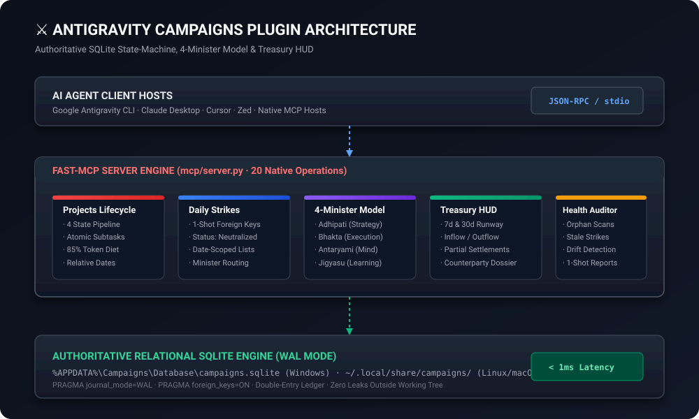

<div align="center">


# ⚔️ Antigravity Campaigns Plugin

### *High-Speed Strategic Task Engine, Tactical Strike Coordinator & Double-Entry Treasury HUD for AI Agents*

<br/>

<a href="https://github.com/karansinghverma979/antigravity-campaigns-plugin">
  
</a>

<br/>
<br/>

<!-- Shields Row 1: Ecosystem & Architecture -->
<p align="center">
  <a href="https://github.com/karansinghverma979/antigravity-campaigns-plugin">
    
  </a>
  <a href="https://modelcontextprotocol.io">
    
  </a>
  <a href="https://sqlite.org">
    
  </a>
  <a href="LICENSE">
    
  </a>
</p>

<!-- Shields Row 2: Security & Supply Chain -->
<p align="center">
  
  
  
  
</p>

<p align="center">
  <b>A production-grade, zero-bloat productivity operating system. Manage high-level projects, daily micro-tasks, milestone trees, client counterparties, and financial runway at wire speed with native AI agent integration.</b>
</p>

---

</div>

<br/>

## 📖 The Story Behind Campaigns & The Sovereign Ecosystem

Heavyweight productivity platforms and complex enterprise managers (like **[Stratagem](https://github.com/karansinghverma979/Stratagem)**) offer deep features, but come at a steep operational cost: heavy system resource consumption, slow database latencies, and clunky interfaces.

**Campaigns was born from a simple realization**:
> *You don't need gigabytes of electron bloat or cloud vendor lock-in to achieve peak personal execution. You need a rock-solid, sub-millisecond local relational state machine that your AI assistant can drive effortlessly.*

The Campaigns architecture provides a unified ecosystem across three specialized tools:
* **🖥️ [Campaigns Desktop Command Center](https://github.com/karansinghverma979/Campaigns)**: High-speed, local-first Svelte 5 & Electron desktop UI for human operators.
* **🤖 [Antigravity Campaigns Plugin](https://github.com/karansinghverma979/antigravity-campaigns-plugin)**: Autonomous AI FastMCP server operating directly on the exact same SQLite database.
* **♟️ [Stratagem Command Matrix](https://github.com/karansinghverma979/Stratagem)**: Deep cinematic macro-strategic life planning and institutional analysis matrix.

---

## 🗺️ Dual Terminology Bridge: Everyday Productivity vs. Tactical Command

Whether you think like a software project manager or a tactical operational commander, Campaigns speaks your language:

| Everyday Productivity Concept | Tactical Command Term | Description & Purpose |
| :--- | :--- | :--- |
| **Project / Strategic Goal** | **`Campaign` / `Task`** | Multi-week outcome transitioning through `Arsenal` ➔ `Execution` ➔ `Archive`. |
| **Daily Action Item** | **`Strike`** | High-priority micro-task scheduled for today. When finished, it is `Neutralized`. |
| **Milestone / Checkpoint** | **`Subtask`** | Ordered checkpoint in a project tree (`Initiated` ➔ `Doing` ➔ `Completed`). |
| **Focus Domain** | **`Minister`** | 4 life pillars: Leadership (`Adhipati`), Craft (`Bhakta`), Reflection (`Antaryami`), Learning (`Jigyasu`). |
| **Cash Flow / Ledger** | **`Treasury`** | Inflow (`Receivable`) and outflow (`Payable`) tracker with 7-day and 30-day runway horizons. |
| **Contacts & Clients** | **`Counterparties`** | Individuals and companies with live calculated net credit/debit balances. |

---

## 🏛️ System Architecture

> **Deep Developer Documentation**: For complete relational DDL schemas, ER diagrams, strict state machines, and token minimization protocols, see **[docs/ARCHITECTURE.md](docs/ARCHITECTURE.md)**.

<p align="center">
  
</p>

```text
┌─────────────────────────────────────────────────────────────────────────────┐
│                       GOOGLE ANTIGRAVITY AGENT / MCP HOST                   │
│                    (Antigravity CLI · Claude Desktop · Cursor)              │
└──────────────────────────────────────┬──────────────────────────────────────┘
                                       │ JSON-RPC (stdio)
                                       ▼
┌─────────────────────────────────────────────────────────────────────────────┐
│                    ANTIGRAVITY CAMPAIGNS PLUGIN (mcp/server.py)             │
├─────────────────────────────────────────────────────────────────────────────┤
│ 🛡️ Strict Whitelist & Type Sanitizer (Foreign Key Enforcement)             │
├──────────────────────────────────────┬──────────────────────────────────────┤
│ 📋 Project Lifecycle Engine          │ 🎯 Daily Strike Coordinator          │
│ 🌳 Subtask Checkpoint Hierarchy      │ 🏷️ Uppercase Taxonomy & Tag Indexer  │
│ 💰 Double-Entry Treasury Ledger      │ 👥 Counterparty Directory Dossier    │
│ 🩺 Health & Integrity Auditor        │ ⚡ Parameterized SQL Query Engine    │
└──────────────────────────────────────┬──────────────────────────────────────┘
                                       │ SQLite WAL Driver (Sub-millisecond)
                                       ▼
┌─────────────────────────────────────────────────────────────────────────────┐
│                        CAMPAIGNS SQLITE DATABASE                            │
│                 `%APPDATA%\Campaigns\Database\campaigns.sqlite`             │
│       [ Tasks · Subtasks · Strikes · Tags · Counterparties · Treasury ]     │
└─────────────────────────────────────────────────────────────────────────────┘
```

---

## ⚡ AI-First Architecture: "Minimum Token Consumption, Maximum Speed"

Autonomous agents face tight context windows and round-trip latency. Campaigns is architected to minimize tokens and maximize speed:

- 📉 **Compact List Payloads (80–85% Token Reduction)**: `campaigns_list_tasks` defaults to `include_description: false`, omitting multiline text to preserve LLM context. Set `include_description: true` only when inspecting a single task runbook.
- 🌳 **1-Shot Multi-Subtask Inception**: Pass `subtasks: ["Milestone 1", "Milestone 2"]` directly to `campaigns_create_task`. The server creates the project and its entire milestone tree in a single atomic transaction—turning 5 tool calls into 1.
- 🎯 **1-Shot Foreign-Key Resolution**: Pass `task_title` directly to `campaigns_create_strike`. The server dynamically resolves foreign keys in SQLite, eliminating redundant search calls.
- ⚡ **Flat Top-Level Mutation Shortcuts**: Update arguments directly at the top level without verbose nested `fields: {}` payloads.
- 📅 **Deterministic Relative Date Engine**: Pass natural expressions like `today`, `tomorrow`, `+3d`, `+2w`, `+1m`, `eom`, `monday`, or `friday`. The server parses exact calendar dates natively.
- 💰 **Horizon-Segmented Runway Telemetry**: `campaigns_get_treasury_dashboard` delivers immediate 7-day and 30-day cash flow runways in a single pass.

---

## 🛠️ Tool Catalog (20 Native Operations)

| Category | MCP Tool Name | Description |
| :--- | :--- | :--- |
| **🩺 Health & HUD** | `campaigns_get_dashboard` | Live overview of active projects, pending daily strikes, and Minister distribution. |
| | `campaigns_audit_health` | Full database integrity scan: detects orphaned records, overdue deadlines, and stale tasks. |
| **📋 Projects / Tasks** | `campaigns_list_tasks` | Filter projects by state (`Arsenal`, `Execution`, `Breach`, `Archive`), stage, or priority. |
| | `campaigns_get_task_details`| Deep relational inspection returning subtask trees, linked strikes, and metadata. |
| | `campaigns_create_task` | Create a new project with priority, deadline, optional atomic subtasks, and briefing. |
| | `campaigns_update_task` | Update project fields (state transitions, deadlines, stages, descriptions) with referential safety. |
| | `campaigns_delete_task` | Cascading removal of a project and its linked subtasks and strikes. |
| **🎯 Daily Strikes** | `campaigns_list_strikes` | List daily action items by execution date (`DD-MM-YYYY` or relative like `today`), status, or Minister. |
| | `campaigns_create_strike` | Create a daily action directive assigned to a Minister with 1-shot task name resolution. |
| | `campaigns_update_strike` | Mark strike `Neutralized`, reschedule dates, or update operational notes. |
| | `campaigns_delete_strike` | Remove a strike from the schedule. |
| **🌳 Milestones & Tags**| `campaigns_manage_subtask` | Create, update status (`Initiated`, `Doing`, `Completed`, `Failed`), or remove subtask milestones. |
| | `campaigns_manage_tag` | Attach or detach taxonomy tags (`WORK`, `FINANCE`, `RESEARCH`, `LEGAL`). |
| **💰 Treasury & Cash Flow**| `campaigns_get_treasury_dashboard`| 1-shot financial summary: payables due, receivables due, 7d/30d horizons, and net balance. |
| | `campaigns_list_treasury` | Query obligations by flow type (`Payable`/`Receivable`), state (`Open`/`Closed`), status, or contact. |
| | `campaigns_manage_treasury` | Create obligations, record partial payments (`record_payment`), or settle balances. |
| **👥 Counterparties**| `campaigns_list_counterparties` | Contact directory with live computed net balances, total receivables, and payables. |
| | `campaigns_get_counterparty_dossier` | Complete 360° counterparty relationship profile and chronological payment history. |
| | `campaigns_manage_counterparty` | Register or update individual and business profiles. |
| **⚡ SQL Engine** | `campaigns_execute_sql` | Execute parameterized SQL queries and transactions with automatic rollback safety. |

---

## 🚀 Quickstart & Setup

### Pathway A: Google Antigravity Plugin (Recommended)

1. Clone or copy into your local Antigravity plugins directory:
   ```bash
   git clone https://github.com/karansinghverma979/antigravity-campaigns-plugin.git ~/.gemini/config/plugins/campaigns-plugin
   ```
2. Antigravity automatically detects `plugin.json`, loads the `campaigns` skill (`skills/campaigns/SKILL.md`), and registers the autonomous agent (`agents/campaigns.md`).

### Pathway B: Universal FastMCP Server (Claude Desktop, Cursor, Zed)

1. Install dependencies:
   ```bash
   pip install mcp>=1.0.0
   ```
2. Initialize database:
   ```bash
   python mcp/init_db.py
   ```
3. Add to your client config:

#### For Antigravity `mcp_config.json`:
```json
{
  "mcpServers": {
    "campaigns-mcp": {
      "command": "python",
      "args": [
        "C:\\Users\\<YourUsername>\\.gemini\\config\\plugins\\campaigns-plugin\\mcp\\server.py"
      ],
      "disabled": false
    }
  }
}
```

#### For Claude Desktop (`claude_desktop_config.json`):
```json
{
  "mcpServers": {
    "campaigns": {
      "command": "python",
      "args": [
        "/path/to/antigravity-campaigns-plugin/mcp/server.py"
      ]
    }
  }
}
```

## 🗄️ Database Lifecycle, Invariants & Real-Time GUI Synchronization

### 1. Zero-Precondition Auto-Creation
If `campaigns.sqlite` does not exist on your computer, the MCP server **automatically provisions the entire database on cold boot**:
* Auto-creates the database directory (`%APPDATA%\Campaigns\Database\` on Windows, `~/.local/share/campaigns/` on Linux/macOS, or via `CAMPAIGNS_DB_PATH`).
* Auto-executes the canonical DDL schema, provisioning all 6 tables (`Tasks`, `Tags`, `Subtasks`, `Strikes`, `Counterparties`, `Treasury`) and 13 indexes in `<1ms`.
* Zero manual SQL scripts or pre-configuration needed.

### 2. Strict Schema Rules & Allowed Entries
All agent actions are enforced against canonical business invariants:
* **Zero-Time Calendar Dates**: Strictly `DD-MM-YYYY` (e.g. `20-09-2026`). Timestamps, hours/minutes, and ISO strings are strictly banned. Natural dates (`today`, `tomorrow`, `+3d`, `monday`, `eom`) auto-resolve to `DD-MM-YYYY`.
* **Task Priorities**: Strictly 3 levels: `'High'`, `'Medium'`, `'Low'`.
* **State & Stage Matrix**:
  * `Arsenal` ➔ `['RawIntel', 'Strategizing']`
  * `Execution` ➔ `['Active', 'Executing']`
  * `Breach` ➔ `['Overdue', 'Breach']`
  * `Archive` ➔ `['Victory', 'Aborted']`
* **Strike Statuses**: Capitalized case: `'Standby'`, `'Engaged'`, `'Neutralized'`, `'Aborted'`, `'Pending'`, `'Template'`, `'Undated'`. Finished strikes are saved strictly as `'Neutralized'`.
* **Subtasks**: Capitalized case (`'Initiated'`, `'Doing'`, `'Completed'`, `'Failed'`). Creation date is strictly `created_at`.
* **Treasury**: Symmetrical `'Payable'` and `'Receivable'` flows with linked counterparties.
* **Ministers**: 4 focal disciplines: `'Adhipati'`, `'Bhakta'`, `'Antaryami'`, `'Jigyasu'`.
* **Tags**: Strictly single-word `UPPERCASE` with underscores (e.g. `MOTOR_WINDING`).

### 3. Real-Time Desktop GUI Synchronization (`Ctrl+R`)
If you run the **Campaigns Electron Desktop Application** alongside Antigravity:
* Both systems execute concurrently on SQLite WAL (Write-Ahead Log) without file locking.
* When AI agents mutate projects, strikes, or cash flow via MCP, press **`Ctrl+R`** in the Campaigns Desktop App (or select **CAMPAIGNS Menu ➔ Hard Reload (`Ctrl+R`)**) to immediately rehydrate all UI stores from disk.

---

## 🔒 Security, Privacy & OpenSSF Standards

- **Zero Machine Path Leaks**: Fully supports `CAMPAIGNS_DB_PATH` environment variable with dynamic fallback across Windows (`%APPDATA%`) and Linux/macOS (`~/.local/share/`).
- **Data Isolation**: Database files (`*.sqlite`, `*.db`) are permanently quarantined outside git tracking.
- **OpenSSF Hardened Workflows**: All GitHub Actions workflows declare `permissions: contents: read` and pin dependencies to immutable 40-character commit SHAs.
- **Vulnerability Disclosure**: Governed by standard [SECURITY.md](SECURITY.md) guidelines.

---

<div align="center">

<b>Maintained by <a href="https://github.com/karansinghverma979">Karan Singh Verma</a> · Released under the MIT License</b>

</div>
