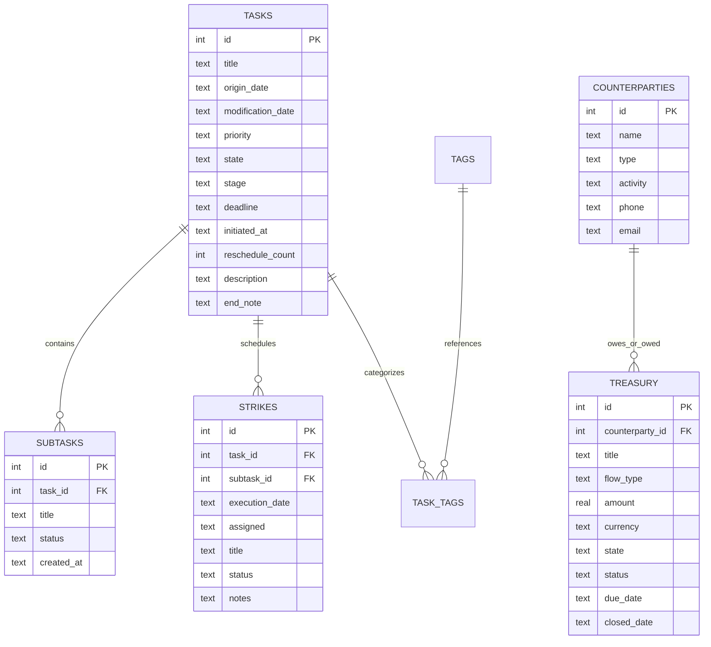

# 🏛️ Antigravity Campaigns Plugin: Developer Architecture Deep-Dive

This document details the internal design, database contracts, state machine invariants, and token optimization protocols of the **Antigravity Campaigns Plugin**.

---

## 📑 Table of Contents
1. [Relational Database DDL & Schema](#1-relational-database-ddl--schema)
2. [State Lifecycle Machine & Minister Model](#2-state-lifecycle-machine--minister-model)
3. [FastMCP Server Architecture (20 Operations)](#3-fastmcp-server-architecture-20-operations)
4. [Token Optimization Mechanics (85% Payload Reduction)](#4-token-optimization-mechanics-85-payload-reduction)
5. [Cross-Platform Storage & Isolation Invariants](#5-cross-platform-storage--isolation-invariants)

---

## 1. Relational Database DDL & Schema

The engine executes on SQLite with Write-Ahead Logging (`WAL`) enabled for concurrent reads and writes without blocking:

```sql
PRAGMA journal_mode = WAL;
PRAGMA foreign_keys = ON;
```

### Entity-Relationship Diagram



---

## 2. State Lifecycle Machine & Minister Model

### Campaign State Pipeline
```text
┌──────────────┐         ┌───────────────┐         ┌────────────┐         ┌─────────────┐
│   Arsenal    │  ───►   │   Execution   │  ───►   │   Breach   │  ───►   │   Archive   │
├──────────────┤         ├───────────────┤         ├────────────┤         ├─────────────┤
│  RawIntel    │         │    Active     │         │  Overdue   │         │   Victory   │
│ Strategizing │         │   Executing   │         │   Breach   │         │   Aborted   │
└──────────────┘         └───────────────┘         └────────────┘         └─────────────┘
```

- **Invariant**: Any task moving to `state = 'Execution'` must have a valid `deadline` (`DD-MM-YYYY`).
- **Breach Transition**: Automated diagnostics check `deadline < reference_date`. If not archived or completed, tasks are flagged as `Breach`.

### 4-Minister Governance Model
- **`Adhipati`**: Strategic direction, financial oversight, high-order governance.
- **`Bhakta`**: Core execution, daily craftsmanship, engineering duty.
- **`Antaryami`**: Self-reflection, cognitive alignment, psychology.
- **`Jigyasu`**: Continuous learning, legal mastery, research.

---

## 3. FastMCP Server Architecture (20 Operations)

The server communicates via JSON-RPC 2.0 over standard I/O (`stdio`). Every incoming call is checked against strict schema whitelists and parameter type validators.

```text
Host Call ➔ JSON-RPC Request ➔ FastMCP Router ➔ Sanitizer ➔ SQLite WAL ➔ JSON Response
```

- Parameter shortcuts: Top-level updates without nested dictionaries.
- Natural date resolution: `today`, `tomorrow`, `+3d`, `+2w`, `+1m`, `eom`, `monday`, `friday` resolve deterministically to `DD-MM-YYYY`.

---

## 4. Token Optimization Mechanics (85% Payload Reduction)

LLM context windows degrade in performance when overloaded with verbose text:
1. **Compact Task List**: `campaigns_list_tasks` omits `description` and `end_note` by default (`include_description: false`). Reduces token payload by **80–85%**.
2. **Atomic 1-Shot Creation**: Pass `subtasks=["Milestone 1", "Milestone 2"]` to `campaigns_create_task` to create parent and children in a single transaction.
3. **1-Shot Foreign Key Resolution**: Pass `task_title="Battle Of..."` to `campaigns_create_strike` without prior listing queries.

---

---

## 5. Database Auto-Provisioning & Storage Invariants

### Cold-Boot Zero-Precondition Auto-Creation
If `campaigns.sqlite` (or `campaigns.db`) does **not pre-exist**, the FastMCP engine automatically handles the entire lifecycle:
1. Resolves canonical cross-platform database directory:
   - **Windows**: `%APPDATA%\Campaigns\Database\campaigns.sqlite`
   - **Linux / macOS**: `~/.local/share/campaigns/campaigns.sqlite`
   - **Custom Override**: Set `CAMPAIGNS_DB_PATH` environment variable.
2. Creates the parent directories automatically (`os.makedirs`).
3. Connects to SQLite with WAL mode (`PRAGMA journal_mode = WAL; PRAGMA foreign_keys = ON;`).
4. Executes the canonical DDL schema (`CREATE TABLE IF NOT EXISTS`), provisioning all 6 tables (`Tasks`, `Tags`, `Subtasks`, `Strikes`, `Counterparties`, `Treasury`) and 13 performance indexes in `<1ms`.
5. **Git Quarantine**: All `*.sqlite`, `*.db`, and journal/WAL files are strictly blocked by `.gitignore`.

---

## 6. Strict Business Rules & Allowed Entries Invariants

All database status, state, priority, flow type, and minister fields across all tables MUST strictly store values conforming to the **Void/Campaigns Canonical Specification**:

| Domain / Field | Allowed Values & Rules | Invariant Violations (Rejected) |
| :--- | :--- | :--- |
| **Temporal Dates** | Strictly `DD-MM-YYYY` calendar strings (e.g. `20-09-2026`). Natural language inputs (`today`, `tomorrow`, `+3d`, `monday`, `eom`) auto-convert to `DD-MM-YYYY`. | `datetime('now')`, ISO-8601 (`YYYY-MM-DDTHH:mm:ss`), timestamps, and `YYYY-MM-DD` are banned. |
| **Task Priorities** | `'High'`, `'Medium'`, `'Low'` | `'Critical'`, `'Urgent'`, `'Normal'` are rejected. |
| **Task States & Stages** | **Arsenal**: `['RawIntel', 'Strategizing']`<br>**Execution**: `['Active', 'Executing']`<br>**Breach**: `['Overdue', 'Breach']`<br>**Archive**: `['Victory', 'Aborted']` | Arbitrary combinations or lowercase strings. |
| **Strike Statuses** | Capitalized Case: `'Standby'`, `'Engaged'`, `'Neutralized'`, `'Aborted'`, `'Pending'`, `'Template'`, `'Undated'` | Completed strikes MUST be saved as `'Neutralized'` (never `'Completed'` or `'Done'`). |
| **Subtask Statuses** | Capitalized Case: `'Initiated'`, `'Doing'`, `'Completed'`, `'Failed'` | Subtasks created column is strictly `created_at` (not `creation_time`). |
| **Treasury States** | `'Open'`, `'Closed'` | Lowercase or arbitrary status names. |
| **Treasury Statuses** | Under Open: `['In Progress', 'Partially Paid', 'Pending', 'Disputed']`<br>Under Closed: `['Paid', 'Settled', 'Defaulted']` | Mismatched state/status pairings are rejected by schema validators. |
| **Treasury Flow Types** | `'Payable'`, `'Receivable'` | Values like `'Income'` or `'Expense'` are converted to canonical flow types. |
| **Ministers** | `'Adhipati'`, `'Bhakta'`, `'Antaryami'`, `'Jigyasu'` | `'Shava'` is locked and non-assignable. |
| **Tags** | Strictly single-word `UPPERCASE` with underscores (e.g. `GOVT`, `MOTOR_WINDING`). | Lowercase or whitespace-containing tags. |

---

## 7. Real-Time Campaigns Desktop GUI Synchronization

When AI agents mutate campaign tasks, strikes, or treasury items via FastMCP:
1. **Concurrency Safety**: SQLite Write-Ahead Logging (`WAL`) allows concurrent reads and writes between the Python MCP server and the Electron desktop application without lock contention.
2. **Desktop GUI Rehydration (`Ctrl+R`)**:
   - In the **Campaigns Electron Desktop App**, press **`Ctrl+R`** at any time.
   - Alternatively, click the top-left **CAMPAIGNS** logo to open the **Command Center Start Menu** and select **Hard Reload (`Ctrl+R`)**.
   - The desktop app immediately invalidates its in-memory Svelte stores and re-queries the latest SQLite state from disk without requiring an app relaunch.

