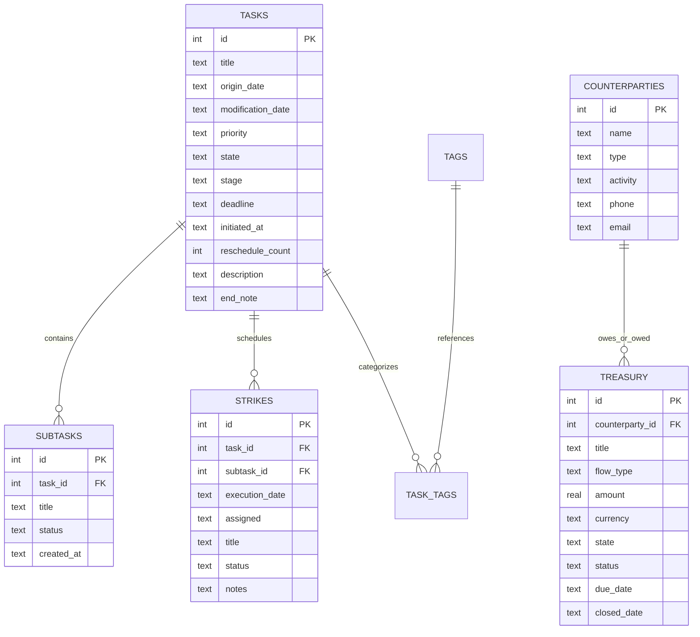

# 🏛️ Antigravity Campaigns Plugin: Developer Architecture Deep-Dive

This document details the internal design, database contracts, state machine invariants, and token optimization protocols of the **Antigravity Campaigns Plugin**.

---

## 📑 Table of Contents
1. [Relational Database DDL & Schema](#1-relational-database-ddl--schema)
2. [State Lifecycle Machine & Minister Model](#2-state-lifecycle-machine--minister-model)
3. [FastMCP Server Architecture (20 Operations)](#3-fastmcp-server-architecture-20-operations)
4. [Token Optimization Mechanics (85% Payload Reduction)](#4-token-optimization-mechanics-85-payload-reduction)
5. [Cross-Platform Storage & Isolation Invariants](#5-cross-platform-storage--isolation-invariants)

---

## 1. Relational Database DDL & Schema

The engine executes on SQLite with Write-Ahead Logging (`WAL`) enabled for concurrent reads and writes without blocking:

```sql
PRAGMA journal_mode = WAL;
PRAGMA foreign_keys = ON;
```

### Entity-Relationship Diagram



---

## 2. State Lifecycle Machine & Minister Model

### Campaign State Pipeline
```text
┌──────────────┐         ┌───────────────┐         ┌────────────┐         ┌─────────────┐
│   Arsenal    │  ───►   │   Execution   │  ───►   │   Breach   │  ───►   │   Archive   │
├──────────────┤         ├───────────────┤         ├────────────┤         ├─────────────┤
│  RawIntel    │         │    Active     │         │  Overdue   │         │   Victory   │
│ Strategizing │         │   Executing   │         │   Breach   │         │   Aborted   │
└──────────────┘         └───────────────┘         └────────────┘         └─────────────┘
```

- **Invariant**: Any task moving to `state = 'Execution'` must have a valid `deadline` (`DD-MM-YYYY`).
- **Breach Transition**: Automated diagnostics check `deadline < reference_date`. If not archived or completed, tasks are flagged as `Breach`.

### 4-Minister Governance Model
- **`Adhipati`**: Strategic direction, financial oversight, high-order governance.
- **`Bhakta`**: Core execution, daily craftsmanship, engineering duty.
- **`Antaryami`**: Self-reflection, cognitive alignment, psychology.
- **`Jigyasu`**: Continuous learning, legal mastery, research.

---

## 3. FastMCP Server Architecture (20 Operations)

The server communicates via JSON-RPC 2.0 over standard I/O (`stdio`). Every incoming call is checked against strict schema whitelists and parameter type validators.

```text
Host Call ➔ JSON-RPC Request ➔ FastMCP Router ➔ Sanitizer ➔ SQLite WAL ➔ JSON Response
```

- Parameter shortcuts: Top-level updates without nested dictionaries.
- Natural date resolution: `today`, `tomorrow`, `+3d`, `+2w`, `+1m`, `eom`, `monday`, `friday` resolve deterministically to `DD-MM-YYYY`.

---

## 4. Token Optimization Mechanics (85% Payload Reduction)

LLM context windows degrade in performance when overloaded with verbose text:
1. **Compact Task List**: `campaigns_list_tasks` omits `description` and `end_note` by default (`include_description: false`). Reduces token payload by **80–85%**.
2. **Atomic 1-Shot Creation**: Pass `subtasks=["Milestone 1", "Milestone 2"]` to `campaigns_create_task` to create parent and children in a single transaction.
3. **1-Shot Foreign Key Resolution**: Pass `task_title="Battle Of..."` to `campaigns_create_strike` without prior listing queries.

---

## 5. Cross-Platform Storage & Isolation Invariants

- **Windows**: `%APPDATA%\Campaigns\Database\campaigns.sqlite`
- **Linux / macOS**: `~/.local/share/campaigns/campaigns.sqlite`
- **Override**: `CAMPAIGNS_DB_PATH` environment variable.
- **Git Quarantine**: All `*.sqlite`, `*.db`, and backup files are blocked by `.gitignore`.
